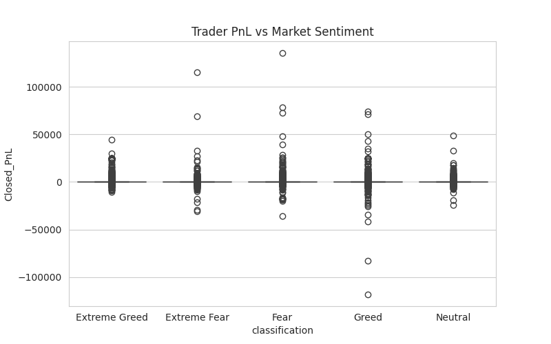
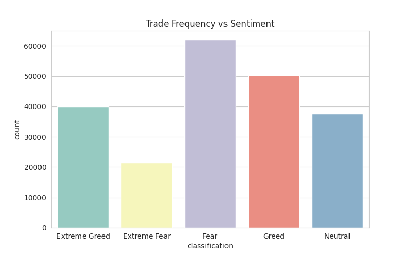
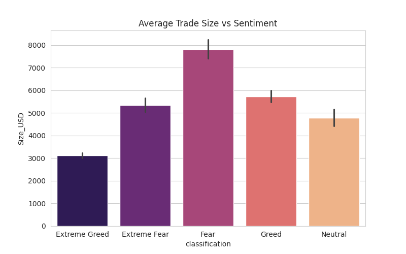

# Trader Behavior vs Market Sentiment Analysis

## Overview

This project analyzes how **Bitcoin market sentiment (Fear vs Greed)** affects trader behavior and profitability using historical trading data.

The goal is to identify patterns that can inform smarter trading strategies.

---

## Datasets

1. Fear & Greed Index dataset
2. Hyperliquid historical trader data

---

## Methodology

The analysis involved the following steps:

- Data cleaning and preprocessing
- Timestamp conversion and alignment
- Merging sentiment data with trader activity
- Feature engineering (PnL, trade frequency, trade size)
- Sentiment-based analysis of trader performance
- Trader segmentation

---

## Key Insights

- Trading activity increases during Greed market sentiment.
- Trader profitability varies across sentiment conditions.
- Frequent traders show higher PnL volatility compared to infrequent traders.

---

## Strategy Recommendations

1. Reduce position size during Fear market conditions.
2. Increase trade frequency during Greed sentiment to capture momentum.
3. Apply stronger risk management for high-frequency traders.

---

## Visualizations

### Trader PnL vs Market Sentiment

---

### Trade Frequency vs Sentiment

---

### Average Trade Size vs Sentiment

